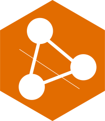

# JDBL 


[](https://github.com/castor-software/jdbl/actions/workflows/build.yml)
[](https://search.maven.org/search?q=g:se.kth.castor%20AND%20a:jdbl*)
[](https://sonarcloud.io/dashboard?id=castor-software_jdbl)
[](https://sonarcloud.io/dashboard?id=castor-software_jdbl)
[](https://sonarcloud.io/dashboard?id=castor-software_jdbl)
[](https://sonarcloud.io/dashboard?id=castor-software_jdbl)
[](https://sonarcloud.io/dashboard?id=castor-software_jdbl)
[](https://sonarcloud.io/dashboard?id=castor-software_jdbl)
[](https://sonarcloud.io/dashboard?id=castor-software_jdbl)
[](https://sonarcloud.io/dashboard?id=castor-software_jdbl)
[](https://sonarcloud.io/dashboard?id=castor-software_jdbl)
[](https://sonarcloud.io/dashboard?id=castor-software_jdbl)
[](https://codecov.io/gh/ASSERT-KTH/jdbl)


<!--
[](https://sonarcloud.io/dashboard?id=castor-software_jdbl)
[](https://hitsofcode.com/view/github/castor-software/jdbl)
[](https://github.com/castor-software/jdbl/blob/master/LICENSE)
-->

## What is JDBL?

JDBL is a **J**ava **D**e**BL**oat tool. With JDBL, developers can automatically specialize Java libraries at build-time through dynamic debloating. 
JDBL executes the library and removes the methods, classes, and dependencies that are not needed to provide the expected output. The result is a smaller bundled file (e.g., JAR or WAR), which is tailored to the specific needs of the client. Using JDBL is great because it saves space on disk, reduces the attack surface, and improves performance of the client application. JDBL can be used as a Maven plugin (see [usage](https://github.com/castor-software/jdbl/tree/master#usage)), with minimal or zero configuration effort.

## How does JDBL work?

JDBL is executed before the `package` phase of the Maven build lifecycle. First, JDBL compiles and [instruments](https://en.wikipedia.org/wiki/Instrumentation_(computer_programming)) the bytecodes of the application and its dependencies. 
Then, JDBL collects accurate coverage information by executing the application based on a given workload. 
All the API members (e.g., classes and methods) used during the execution are collected at runtime. 
For more details about the coverage technique employed by JDBL read this [blog post](https://www.cesarsotovalero.net/blog/diversity-driven-software-debloat.html). JDBL removes the rest of unused API members through bytecode transformations using the [ASM](https://asm.ow2.io/) library.
Finally, the debloated application is validated through the Maven `package` phase and it is bundled as a JAR or WAR file. 

**NOTE:** JDBL produces a smaller, debloated version of the Java application without modifying its source code. The modified version is automatically packaged as a JAR file as resulting from the Maven build lifecycle.

<!--
JDBL supports three types of debloating strategies:

- **entry-point-debloat:** removes the class members that used after running the application from a given entry-point.
- **test-based-debloat:** removes the class members that are not covered by the test suite.
- **conservative-debloat:** removes the class members that are not referenced by the application, as determined statically.

The **entry-point-debloat** strategy is the most aggressive approach. In this case, the bytecode is instrumented during the Maven `compile` phase, probes are inserted in the bytecode, and the application is executed in order to collect ). Then, the class members that were not covered are removed from the bytecode, and the transformed application is packaged as a specialized ad debloated JAR file.  

The **test-based-debloat** strategy is similar to the **entry-point**; the difference is that the execution traces are collected based on the execution of the test suite of the project.

The **conservative-debloat** strategy is the less aggressive approach. It relies on static analysis to construct a call graph of class members calls, which contains all the class members referenced by the application. Then, the members that are not referenced (a.k.a [dead code](https://en.wikipedia.org/wiki/Dead_code)) are removed from the bytecode. This approach is similar to shrinking technique performed by [Proguard](https://www.guardsquare.com/en/products/proguard), with the difference JDBL executed the debloat thorough the Maven build phases.    

-->

## Why is JDBL different?

Existing debloating tools for Java (e.g., Proguard) are rather conservative when removing API members because they rely on static analysis. In contrast, JDBL takes advantage of dynamic analysis to shrink all the bytecode that is not used during a particular execution trace. This way, JDBL outperforms competitors by removing more unnecessary while keeping the desired functionality. JDBL is fully automatic; no configuration is required.

## Usage

To use JDBL as a Maven plugin, first clone this repository and run `mvn clean install`. Then, add the plugin to the `pom.xml` of the Maven project to be debloated:

```xml
<plugin>
    <groupId>se.kth.castor</groupId>
    <artifactId>jdbl-maven-plugin</artifactId>
    <version>1.0.0</version>
    <executions>
        <execution>
            <goals>
                <goal>${strategy}</goal>
            </goals>
        </execution>
    </executions>
</plugin>
```

The property `${strategy}` can take one of the two following values, depending on the debloating strategy adopted:

- **test-based-debloat** Removes the API members that are not covered by the test suite of the Maven project.
- **entry-point-debloat** Removes the API members that are used after compiling and executing the Maven project from a given entry-point.

### Optional parameters

In the case of the **entry-point** strategy, the following additional configuration parameters can be provided:

| Name   |  Type |   Description      | 
|:----------|:-------------:| :-------------| 
| `<entryClass>` | `<String>` | Fully qualified name of the class used as the entry point of the application. **Typical value is:** `Main`.
| `<entryMethod>` | `<String>` | Fully qualified name of the method in the `<entryClass>` used as the entry point of the application. **Typical value is:** `main`./|
| `<entryParameters>` | `Set<String>` | Parameters of the `<entryMethod>` used provided. Only string values separated by commas are permitted.
| `<skipJDBL>` | `boolean` | Skip plugin execution completely. **Default value is:** `false`.|

## License

JDBL is distributed under the MIT License. See [LICENSE](https://github.com/castor-software/jdbl/blob/master/LICENSE) for more information.

## Funding

JDBL is partially funded by the [Wallenberg Autonomous Systems and Software Program (WASP)](https://wasp-sweden.org).


